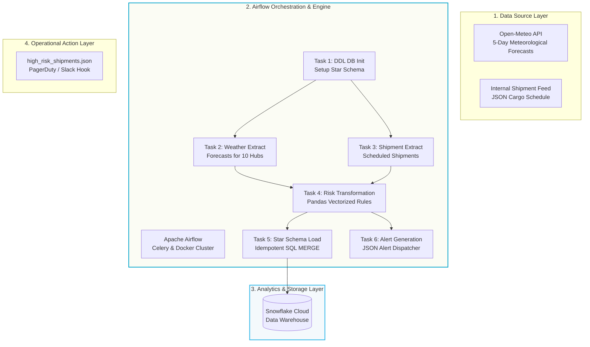
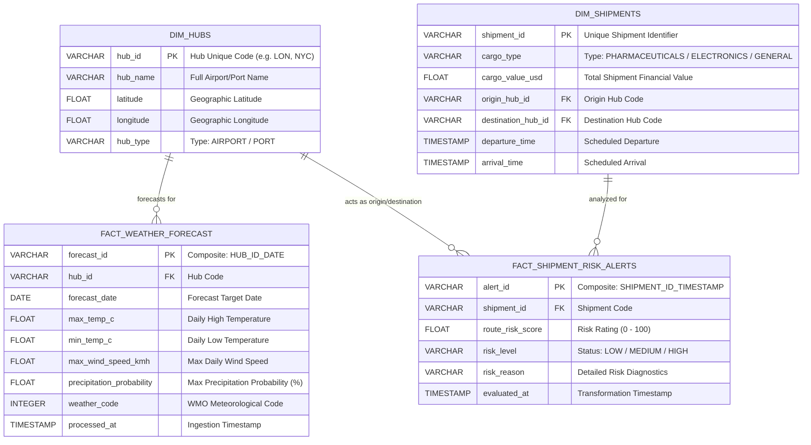

# Enterprise Logistics Weather Risk Engine 🚚⛈️

An automated, containerized **Supply Chain Data Engineering Pipeline** that predicts and mitigates weather-related transit delays and cargo damage across global shipping lanes. 

This enterprise-grade system ingests multi-source data (real-time meteorological forecasts and operational shipment feeds), executes a **custom risk scoring engine**, models data into a **Snowflake Cloud Data Warehouse Star Schema**, and triggers **automated operational alert feeds** for logistics dispatchers.

---

## 💼 The Business Problem Scenario
Global shipping carriers (e.g., FedEx, DHL, UPS) transport high-value, time-critical, and environmental-sensitive cargo (such as **biological pharmaceuticals** requiring cold chain custody or **sensitive microelectronics** vulnerable to moisture). 

Unanticipated extreme weather events (freezing temperatures, localized torrential storms, gale-force winds) during transit cause:
1. **Perishable Spoilage**: Extreme cold/heat ruins biological pharmaceuticals.
2. **Transit Bottlenecks**: Severe wind speeds stall airport and marine port container crane operations.
3. **SLA Penalties**: Delayed deliveries cost logistics carriers millions in client service level agreements (SLAs).

### 🛠️ Solution Architecture
Instead of just gathering historical weather logs, this pipeline functions as an **Operational Risk Intelligence Platform**:



---

## 📊 Enterprise Data Modeling (Snowflake Star Schema)
To enable fast analytic BI queries and support dimensional reporting, data is modeled as a relational **Star Schema** in Snowflake instead of flat tables:



---

## ⚡ The Risk Evaluation Engine (Pandas Transformation Rules)
The pipeline correlates the transit schedule of each shipment with the weather forecasts at its origin and destination on its scheduled travel days. A **custom rule-based scoring engine** calculates risk:

| Cargo Class | Weather Risk Condition | Impact | Score Weight |
| :--- | :--- | :--- | :--- |
| **PHARMACEUTICALS** | Minimum Temperature $< 2^\circ\text{C}$ ($35.6^\circ\text{F}$) | **Freezing Spoilage** (Ruined Vaccines/Biologics) | **+60.0** |
| **PHARMACEUTICALS** | Maximum Temperature $> 35^\circ\text{C}$ ($95^\circ\text{F}$) | **Extreme Heat Spoilage** (Ruined shelf-stable meds) | **+50.0** |
| **ELECTRONICS** | Precipitation Probability $> 75\%$ | **Moisture Water Spillage** (Ruined Microchips) | **+40.0** |
| **ALL CARGO** | Maximum Wind Speed $> 40\text{ km/h}$ | **Logistics Delays** (Grounded aircraft / marine delays) | **+45.0** |
| **ALL CARGO** | Severe WMO Codes (Thunderstorms, Heavy Snow) | **Severe Weather Safety Warning** | **+30.0** |

*Overall Risk Rating is capped at 100. Ratings $\ge 60$ trigger **HIGH** Risk levels, while ratings $\ge 30$ trigger **MEDIUM** Risk.*

---

## 🛠️ Technology Stack
* **Orchestration**: **Apache Airflow** (TaskFlow API, dynamic parallel task grouping).
* **Data Transformation**: **Python** & **Pandas** (vectorized joins & multi-source matching).
* **Cloud Data Warehouse**: **Snowflake** (Relational schemas, upsert logic).
* **Data Ingestion**: **Open-Meteo REST API** (real-time forecasts) & **ERP JSON Feeds** (shipments).
* **Containerization**: **Docker** & **Docker-Compose** (multi-node CeleryExecutor cluster, Redis, Postgres).

---

## 📂 Repository Structure
* [dags/logistics_risk_etl_dag.py](file:///f:/Learning/Data%20Engineering%20Weather_etl_pipeline/dags/logistics_risk_etl_dag.py): The primary Airflow DAG orchestrating the entire E-T-L and Alert flow.
* [dags/snowflake_setup/setup_star_schema.sql](file:///f:/Learning/Data%20Engineering%20Weather_etl_pipeline/dags/snowflake_setup/setup_star_schema.sql): DDL SQL script defining the tables, references, and seed dimensional data for Snowflake.
* [dags/data/shipments_schedule.json](file:///f:/Learning/Data%20Engineering%20Weather_etl_pipeline/dags/data/shipments_schedule.json): Operational JSON cargo shipment logs.
* [dags/alerts/high_risk_shipments.json](file:///f:/Learning/Data%20Engineering%20Weather_etl_pipeline/dags/alerts/high_risk_shipments.json): Auto-generated target destination for dispatch alerts.
* [docker-compose.yaml](file:///f:/Learning/Data%20Engineering%20Weather_etl_pipeline/docker-compose.yaml): Local multi-node Airflow cluster docker definition.
* [Dockerfile](file:///f:/Learning/Data%20Engineering%20Weather_etl_pipeline/Dockerfile): Worker image builds carrying `snowflake-sqlalchemy` dependencies.

---

## ⚙️ How to Deploy and Run

### 1. Prerequisite Checklist
- **Docker Desktop** installed and running on your local machine.
- A **Snowflake Account** where you have credentials to create schemas and tables.

### 2. Startup the Containers
Spin up your Airflow Celery container nodes:
```bash
docker-compose up -d --build
```
This launches:
- Airflow Webserver (`http://localhost:8080`)
- Airflow Scheduler & Celery Workers
- PostgreSQL (Airflow metadata database)
- Redis (Celery broker queue)

### 3. Establish Airflow Credentials
1. Open `http://localhost:8080` in your browser (Default username/password: `airflow` / `airflow`).
2. Navigate to **Admin -> Connections**.
3. Create a new Connection with:
   - **Connection Id**: `snowflake_creds`
   - **Connection Type**: `Generic`
   - **Host**: *Your Snowflake Account Locator (e.g., paxvtth-ft66584)*
   - **Login**: *Your Snowflake Username*
   - **Password**: *Your Snowflake Password*
   - **Schema**: *WEATHER_SCHEMA*
   - **Port**: `443`
   - **Extra**:
     ```json
     {
       "database": "WEATHER_DB",
       "warehouse": "COMPUTE_WH"
     }
     ```

### 4. Run the Pipeline!
1. Locate `supply_chain_logistics_weather_risk_pipeline` in the Airflow dashboard.
2. Toggle it to **Unpaused**.
3. Click the **Play icon (Trigger DAG)** to start processing.
4. Watch the pipeline automatically run DDL setup in Snowflake, ingest live global forecasts, run risk assessments, load dimensional models into the cloud, and issue warning payloads to `/dags/alerts/high_risk_shipments.json`.
